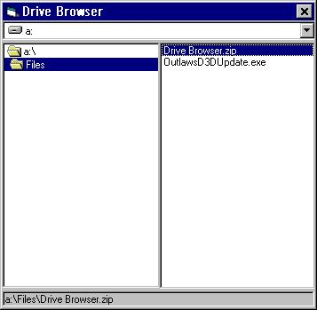



## Drive Browser Example

### Description

This is a fairly simple code that is an alternative to Windows

Explorer or My Computer. An example using the DriveListBox,

DirListBox and FileListBox, this code was "inspired" by File

Browser, uploaded a few days ago. However, I wrote every line

of code in it except for the "Error" section, you'll see when

you download it. This application distances itself from most,

maybe all of the other file browsers on PSC because it enables

you to OPEN files from right within the application, by using

the Shell ("Start ") API call. This enables you to open all

types of files that are associated with an application, not

just open specific files. This function does not ALWAYS work,

I don't have a clue why not, but if anyone could

point out why this is happening, if they could post an

UNDERSTANDABLE comment, it would be greatly appreciated. Now,

if you think this code is worthy, throw a few positive comments

amd votes my way, and bear in mind, I'm 11 and this is in the

BEGINNER category. Some of you seem to derive some strange

pleaseure from rating beginner code at the intermediate, or even

advanced level. I hope this Drive Browser comes in handy or teaches

you something!
 
### More Info
 

             |
---                |---
**Submitted On**   |2001-08-01 09:45:18
**By**             |[Slippah](https://github.com/Planet-Source-Code/PSCIndex/blob/master/ByAuthor/slippah.md)
**Level**          |Beginner
**User Rating**    |3.8 (19 globes from 5 users)
**Compatibility**  |VB 6\.0
**Category**       |[Files/ File Controls/ Input/ Output](https://github.com/Planet-Source-Code/PSCIndex/blob/master/ByCategory/files-file-controls-input-output__1-3.md)
**World**          |[Visual Basic](https://github.com/Planet-Source-Code/PSCIndex/blob/master/ByWorld/visual-basic.md)
**Archive File**   |[Drive Brow23868812001\.zip](https://github.com/Planet-Source-Code/slippah-drive-browser-example__1-25722/archive/master.zip)

